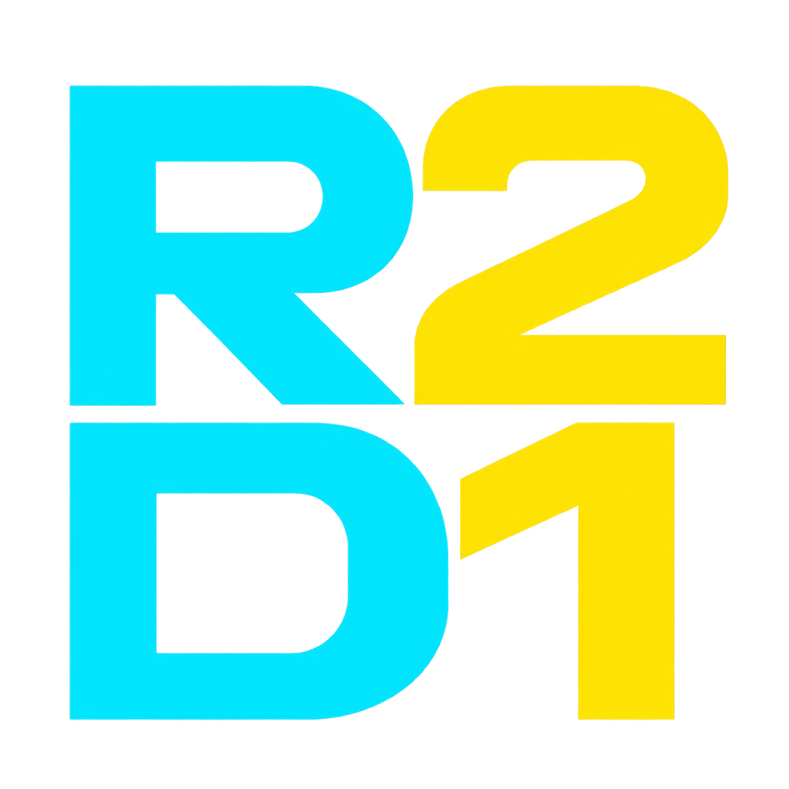

<p align="center">
  
</p>

<h1 align="center">R2D1</h1>

<p align="center">
  A lightweight Java document store powered by Cloudflare R2 for storage and D1 for indexing,
  filtering, sorting, and pagination.
</p>

R2D1 is a framework-independent Java library that combines **Cloudflare R2** and **Cloudflare D1**
to provide a simple document-oriented data store.

The idea is simple:

- **R2 is the authoritative document store.**
- **D1 is a rebuildable index projection used to find documents.**

R2D1 is intentionally designed around a small and predictable query model rather than trying to
provide a full SQL database or ORM.

## Architecture

```text
R2D1Collection / Query              synchronous public API
              │
              ▼
Synchronous collection façade      blocking boundary
              │
              ▼
CompletionStage orchestration      asynchronous composition
              │
       ┌──────┴──────┐
       ▼             ▼
DocumentStore     IndexStore        technology-neutral SPI
       │             │
       ▼             ├──────────────┐
Cloudflare R2         ▼              ▼
Documents        Cloudflare D1   JDBC foundation
                 Indexes         Future local indexes
```

The public collection API is synchronous. Storage I/O is composed asynchronously, and
`StageSupport.await()` is used only at the synchronous boundary. The storage SPI exposes
`CompletionStage` without leaking AWS or Cloudflare transport types and does not define an
executor, callback thread, cancellation guarantee, or timeout policy.

Persistence operations follow these paths:

- `put`: serialize the document, write R2, then upsert the D1 index row.
- `get`: read the authoritative document from R2 only.
- `query`: query D1, then fetch the matching R2 documents concurrently while preserving D1 order.
- `delete`: delete the R2 document, then delete the D1 index row.

R2 and D1 do not share an atomic transaction. A successful R2 mutation followed by a failed D1
mutation is reported as a partial failure and may require an explicit index rebuild.

## Goals

R2D1 aims to provide:

- Simple CRUD operations
- Indexed filtering
- Indexed sorting
- Cursor-based pagination
- Asynchronous storage orchestration
- A small and predictable query API
- A framework-independent Java API
- Optional integrations for frameworks such as Spring

## Non-Goals

R2D1 is not intended to be:

- A relational database
- A general-purpose SQL abstraction
- An ORM
- A replacement for complex query engines
- A system for joins or arbitrary aggregations

Queries are intentionally limited to fields that have been explicitly indexed.

## Storage and Query Model

### R2 owns the document

The complete document is stored in Cloudflare R2.

D1 should contain only the metadata and indexed fields necessary to locate and query documents.

```text
R2
└── users/01JXYZ...
    └── Complete document

D1
└── users
    ├── document_id
    ├── country
    ├── status
    └── createdAt
```

### D1 is a rebuildable index

D1 is treated as an index over the documents stored in R2 rather than the authoritative document
store.

This allows the indexing layer to be rebuilt from the underlying document data when necessary.

### Queries are predictable

R2D1 deliberately avoids querying unindexed document fields.

A query such as:

```java
users.query()
    .where("country").eq("NZ")
    .sortBy("createdAt", SortDirection.DESC)
    .limit(20)
    .fetch();
```

is valid only when the queried and sorted fields have been configured appropriately for indexing.

R2D1 will not download large numbers of R2 objects and perform filtering in application memory.

## Core Java API

The core module defines the framework-independent contracts shown below. Applications configure the
R2 and D1 adapters and supply a `DocumentCodec`, keeping domain serialization independent of any
specific JSON library.

```java
R2DocumentStore documentStore = configuredR2DocumentStore;
D1IndexStore indexStore = configuredD1IndexStore;
DocumentCodec documentCodec = applicationDocumentCodec;

R2D1 db = R2D1.builder()
    .collectionFactory(new PersistenceCollectionFactory(
        documentStore,
        indexStore,
        documentCodec,
        indexStore::initialize))
    .build();

R2D1Collection<User> users = db.collection(User.class);

User document = applicationUser;
users.put(document);

Optional<User> storedUser = users.get("user-123");

Page<User> page = users.query()
    .where("country").eq("NZ")
    .sortBy("createdAt", SortDirection.DESC)
    .limit(20)
    .fetch();

users.delete("user-123");

// Run explicitly during a maintenance window when the D1 projection must be recovered.
users.rebuildIndex();
```

`R2DocumentStore` and `D1IndexStore` implement `AutoCloseable`. The application owns their lifecycle;
`PersistenceCollectionFactory` does not close them.

Document metadata may be declared using annotations:

```java
@Document("users")
public class User {

    @Id
    private String id;

    @Index
    private String country;

    @Index
    private String status;

    @Index
    private Long createdAt;

    private String name;
}
```

Only indexed fields participate in filtering and sorting. The D1 v1 adapter supports `String`,
`Long`, `Double`, and `Boolean` index values and treats every `@Index` field as sortable. The
existing `sortable` annotation member remains for public API compatibility but does not restrict D1
sorting.

Filters are combined with logical AND and support only equality, inequality, and ordered
comparisons. A query requires a positive result limit and may contain one indexed-field sort and
one opaque continuation cursor. The storage adapter is responsible for validating field metadata
before executing a query.

## Consistency Recovery

R2 is the authoritative document store. D1 is a disposable materialized index that may become
temporarily inconsistent when an R2 write or delete succeeds and the following D1 operation fails.
R2D1 exposes an explicit collection-level recovery operation for this case:

```java
R2D1Collection<User> users = db.collection(User.class);
users.rebuildIndex();
```

The rebuild lists R2 document keys in bounded pages, loads each authoritative document, derives its
index entry through the normal metadata path, clears only the collection's D1 rows, and writes the
replacement rows. D1 tables, columns, and SQLite indexes are preserved. Missing D1 rows are restored
and stale D1 rows are removed, including when the authoritative collection is empty.

Rebuilds are synchronous at the public API and asynchronously composed internally. They are
idempotent for an unchanged R2 collection but are not atomic across R2 and D1. A failure after the D1
rows are cleared can leave the index incomplete; resolve the failure and run `rebuildIndex()` again.
Run this maintenance operation while application writes to the collection are paused. R2D1 does not
add background reconciliation, automatic retries, distributed locks, queues, or Workers.

## Modules

R2D1 is organized as a modular project.

```text
r2d1-core
    Core API and abstractions

r2d1-d1
    Cloudflare D1 integration

r2d1-r2
    Cloudflare R2 DocumentStore adapter using AWS SDK v2

r2d1-jdbc
    Bounded JDBC execution and internal dialect foundation for IndexStore adapters

r2d1-integration-tests
    Opt-in live tests against dedicated Cloudflare R2 and D1 resources
```

Framework-specific integrations will remain separate from the core library.

Public Java packages use JSpecify `@NullMarked` semantics. Nullable API positions, such as a final
page's absent `nextCursor`, are declared explicitly with `@Nullable`.

Future modules may include:

```text
r2d1-spring
r2d1-spring-boot-starter
```

The core API will not depend on Spring.

## D1 Schema Initialization

The D1 module uses the Cloudflare D1 REST API through Java's reusable asynchronous `HttpClient` and
uses Avaje JSON-B generated adapters for the REST protocol. A document type's schema must be
initialized before its index operations are used:

```java
D1IndexStore indexes =
    new D1IndexStore(new D1Config(accountId, databaseId, apiToken));

CompletionStage<Void> initialized = indexes.initialize(User.class);
```

`PersistenceCollectionFactory` invokes this initialization through the supplied collection
initializer and waits for it at the synchronous collection boundary. The D1 adapter itself does not
block, create executors, retry requests, serialize complete documents, or manage Cloudflare
infrastructure.

## JDBC Foundation

The optional `r2d1-jdbc` module adapts blocking JDBC operations to the asynchronous `IndexStore`
contract through an explicitly owned, bounded execution resource:

```java
try (JdbcExecution execution = JdbcExecution.create(8, 128)) {
    JdbcIndexStore indexes = new JdbcIndexStore(applicationDataSource, execution);
    // Supply indexes and indexes::initialize to PersistenceCollectionFactory.
}
```

`JdbcIndexStore` owns neither the standard `DataSource` nor `JdbcExecution`. A caller that wraps its
own executor also retains that executor's lifecycle. JDBC connections are scoped to individual
operations, while database-specific SQL and schema behavior remain behind an internal dialect
boundary.

This foundation release deliberately includes no JDBC driver or built-in database dialect. H2,
HSQLDB, and SQLite support will be added separately; until then, database detection fails before any
schema mutation. The module does not provide connection pooling, retries, virtual-thread execution,
Spring integration, or a public dialect extension SPI.

## Project Status

🚧 **R2D1 is currently in the early design and development stage.**

The first core API contracts, the R2 document adapter, the D1 index adapter, synchronous persistence
orchestration, and the JDBC adapter foundation are available but remain unstable. Explicit index
recovery through `rebuildIndex()` is available, but automatic reconciliation and background repair
are not. JDBC database dialects are not implemented yet. Module internals may change significantly
before the first release.

## Requirements

- Java 21+
- Cloudflare account
- Cloudflare R2
- Cloudflare D1

## Development

Build and verify the complete project from the repository root:

```shell
./gradlew clean check
./gradlew javadoc
```

Format Java sources with:

```shell
./gradlew spotlessApply
```

### Cloudflare integration tests

Live integration tests are isolated in the `r2d1-integration-tests` module and are never run by
the standard `build` or `check` tasks. They must use an R2 bucket and D1 database dedicated to
R2D1 integration testing. Do not point them at production resources or resources shared with an
application.

Create the dedicated R2 bucket and D1 database manually before the first run. The test suite does
not provision or delete Cloudflare resources.

The integration-test task reads the process environment directly and does not load a `.env` file.
If you keep the variables in a local file, source it before running Gradle:

```shell
set -a
source /absolute/path/to/r2d1-integration.env
set +a
```

This repository does not ignore `.env` files. Keep credential files outside the checkout or add
them to your local Git exclude configuration, and never commit Cloudflare credentials.

Set every required environment variable before running the opt-in task:

```shell
export R2D1_IT_R2_ENDPOINT="https://<account-id>.r2.cloudflarestorage.com"
export R2D1_IT_R2_ACCESS_KEY_ID="<dedicated-r2-access-key-id>"
export R2D1_IT_R2_SECRET_ACCESS_KEY="<dedicated-r2-secret-access-key>"
export R2D1_IT_R2_BUCKET_NAME="<dedicated-r2-bucket>"
export R2D1_IT_D1_ACCOUNT_ID="<cloudflare-account-id>"
export R2D1_IT_D1_DATABASE_ID="<dedicated-d1-database-id>"
export R2D1_IT_D1_API_TOKEN="<dedicated-d1-api-token>"
export R2D1_IT_CONFIRM_DEDICATED_RESOURCES="true"

GRADLE_USER_HOME=/tmp/r2d1-gradle-home \
  ./gradlew :r2d1-integration-tests:integrationTest
```

An explicit integration-test run fails when any variable is missing or the dedicated-resource
confirmation is not exactly `true`. The tests never print credential values. They delete only
objects and rows in their versioned test collections before and after each scenario; D1 tables,
columns, and SQLite indexes are retained. The first run creates the managed D1 schemas when they do
not exist, and later runs validate and reuse those schemas.

## License

R2D1 is licensed under the [Apache License 2.0](LICENSE).

## Project

R2D1 is developed under **NexCraft**.

- GitHub Organization: `nexcraft-dev`
- Website: `nexcraft.dev`
